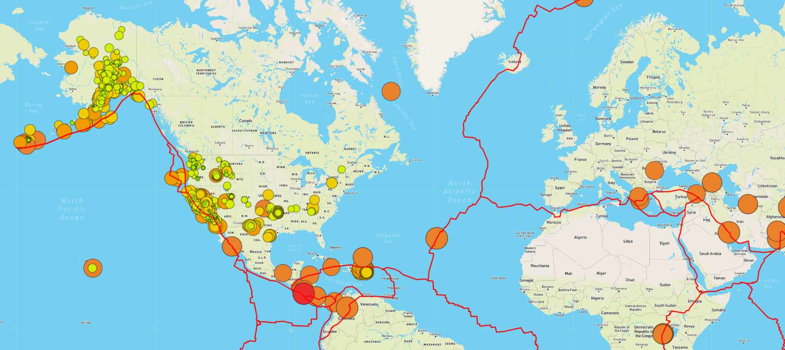

# Mapping_Earthquakes

## Purpose
The purpose of this project is to visually show the differences between the magnitudes of earthquakes all over the world for the last seven days.

## Tasks
To complete this project, we use a URL for GeoJSON earthquake data from the USGS website and retrieve geographical coordinates and the magnitudes of earthquakes for the last seven days. Then add the data to a map.

## Summary
The project is coded in JavaScript and the D3.js library to retrieve the coordinates and magnitudes of the earthquakes from the GeoJSON data. The Leaflet library is used to plot the data on a Mapbox map through an API request and create interactivity for the earthquake data. The webpage can toggle between 3 types of map styles and 3 filter options of tectonic plates, all earthquakes and earthquakes larger than a magnitude of 4.5. 
